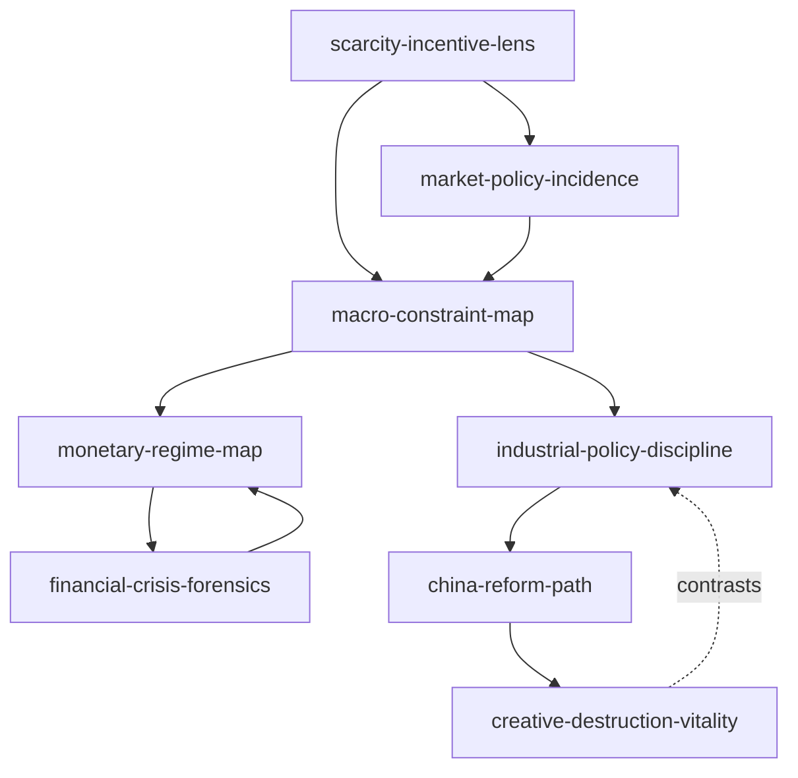
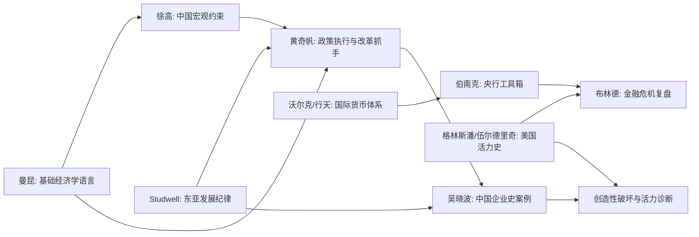

# 01 经济学和大势 Skill Index

> 本分类由 book2skill / RIA-TV++ 蒸馏，产出 8 个 skills。处理时间：2026-06-18。

## 关于这个分类

- **范围**：经济学基础、宏观政策、货币金融、东亚发展、中国改革、中国企业史。
- **一句话主旨**：用经济学约束、制度条件、金融周期和产业演化判断经济大势。
- **分类理解**：见 [BOOK_OVERVIEW.md](./BOOK_OVERVIEW.md)。

## 按问题选择 skill

| 用户问题 | 推荐 skill | 先读什么 | 不适合什么 |
|---|---|---|---|
| “这个选择值不值？”“政策会让人怎么变行为？” | [`scarcity-incentive-lens`](./scarcity-incentive-lens/SKILL.md) | 取舍、机会成本、边际、激励 | 宏观预测、市场均衡细算 |
| “限价、税、补贴、关税会造成什么结果？” | [`market-policy-incidence`](./market-policy-incidence/SKILL.md) | 供需、弹性、剩余、税负归宿 | 单纯价值判断 |
| “中国宏观问题该先看什么约束？” | [`macro-constraint-map`](./macro-constraint-map/SKILL.md) | 增长、债务、货币、房地产、制度容器 | 高频数据择时 |
| “央行为什么这样做？汇率、通胀、QE 怎么理解？” | [`monetary-regime-map`](./monetary-regime-map/SKILL.md) | 货币锚、央行信誉、工具箱、预期 | 预测利率路径 |
| “这是不是金融危机风险？”“该怎么复盘危机？” | [`financial-crisis-forensics`](./financial-crisis-forensics/SKILL.md) | 泡沫、杠杆、监管、激励、救助 | 普通股价波动 |
| “一个国家/地区该如何发展制造业？” | [`industrial-policy-discipline`](./industrial-policy-discipline/SKILL.md) | 农业基础、制造业、金融管制、出口纪律 | 无退出机制的补贴论证 |
| “中国这项改革/政策/产业变化该放在哪条线上？” | [`china-reform-path`](./china-reform-path/SKILL.md) | 制度红利、要素配置、资本市场、开放规则 | 意识形态争论 |
| “一个经济体或行业还有没有活力？” | [`creative-destruction-vitality`](./creative-destruction-vitality/SKILL.md) | 生产率、创新、企业家、监管、社会成本 | 盲目歌颂破坏 |

## 推荐调用顺序

1. `scarcity-incentive-lens`：先把问题从愿望改写成约束与取舍。
2. `market-policy-incidence`：若涉及价格、税、补贴、管制，检查市场机制和分配结果。
3. `macro-constraint-map`：若问题上升到国家宏观，定位增长、债务、货币和制度约束。
4. `monetary-regime-map`：若涉及央行、汇率、通胀和金融稳定，分析制度和工具箱。
5. `financial-crisis-forensics`：若出现泡沫、杠杆和恐慌，做危机链条复盘。
6. `industrial-policy-discipline`：若讨论发展战略或产业政策，检查纪律和退出机制。
7. `china-reform-path`：若讨论中国改革或产业变化，放回历史阶段与制度红利。
8. `creative-destruction-vitality`：最后评估长期生产率和经济活力。

## Skill 关系图



图例：

- `-->` depends-on 或 composes-with
- `-. contrasts .->` contrasts-with

## 书之间的关系



## 审计轨迹

- 候选单元池：[candidates/](./candidates/)
- 通过单元：[verified.md](./verified.md)
- 被淘汰候选：[rejected/rejected-units.md](./rejected/rejected-units.md)
- 来源与去重：[source/SOURCE.md](./source/SOURCE.md)

## 接入 darwin-skill

每个 skill 均带有 `test-prompts.json`，可用于后续 darwin-skill 进化。发布前先运行：

```bash
node scripts/validate-book2skill.js 01-economics-and-trends-skills
```

