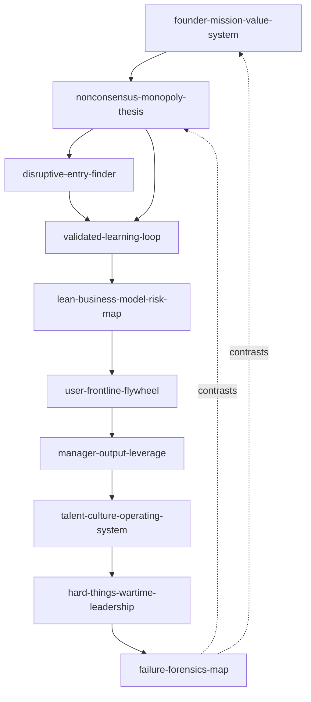
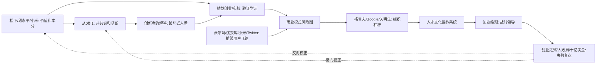

# 02 创业思维 Skill Index

> 本分类由 book2skill / RIA-TV++ 蒸馏，产出 10 个 skills。处理时间：2026-06-18。

## 关于这个分类

- **范围**：企业家价值观、从 0 到 1、精益验证、运营管理、创业危机与失败复盘。
- **一句话主旨**：用价值边界、机会结构、验证循环、组织杠杆和失败复盘，把创业从冲动变成可持续经营系统。
- **分类理解**：见 [BOOK_OVERVIEW.md](./BOOK_OVERVIEW.md)。

## 按问题选择 skill

| 用户问题 | 推荐 skill | 先读什么 | 不适合什么 |
|---|---|---|---|
| “这个创业方向到底为什么值得做？”“哪些事不能做？” | [`founder-mission-value-system`](./founder-mission-value-system/SKILL.md) | 使命、用户价值、本分、不做清单 | 纯增长技巧 |
| “这是不是一个真正不同的机会？” | [`nonconsensus-monopoly-thesis`](./nonconsensus-monopoly-thesis/SKILL.md) | 非共识秘密、垄断特征、市场定义 | 红海执行优化 |
| “我该从哪里切入才能打过大公司？” | [`disruptive-entry-finder`](./disruptive-entry-finder/SKILL.md) | 客户任务、新市场/低端入场、破坏式路径 | 普通差异化营销 |
| “MVP 怎么做？什么时候转向？” | [`validated-learning-loop`](./validated-learning-loop/SKILL.md) | 假设、MVP、指标、转向/坚持 | 已经确定需求的工程执行 |
| “商业模式哪里最危险？” | [`lean-business-model-risk-map`](./lean-business-model-risk-map/SKILL.md) | 精益画布、风险排序、收入成本闭环 | 融资 BP 美化 |
| “用户、门店、口碑和前线反馈怎么形成飞轮？” | [`user-frontline-flywheel`](./user-frontline-flywheel/SKILL.md) | 用户现场、顾客第一、口碑和成本效率 | 脱离现场的品牌叙事 |
| “我作为管理者该把力气用在哪里？” | [`manager-output-leverage`](./manager-output-leverage/SKILL.md) | 经理人产出、杠杆活动、会议/培训/决策 | 个人效率技巧 |
| “怎么搭团队、文化和人才标准？” | [`talent-culture-operating-system`](./talent-culture-operating-system/SKILL.md) | 创意精英、自驱人才、店长/经营者培养 | 口号式文化墙 |
| “公司现在很难，裁员、现金、转型该怎么面对？” | [`hard-things-wartime-leadership`](./hard-things-wartime-leadership/SKILL.md) | 战时 CEO、坏消息、艰难沟通、现金约束 | 平稳期 OKR 优化 |
| “失败到底因为什么，怎么避免重演？” | [`failure-forensics-map`](./failure-forensics-map/SKILL.md) | 失败基因、模式悖论、资本冒进、组织失灵 | 事后找替罪羊 |

## 推荐调用顺序

1. `founder-mission-value-system`：先确定创业边界、用户价值和长期约束。
2. `nonconsensus-monopoly-thesis`：若问题是机会选择，判断是否存在非共识秘密和可防守结构。
3. `disruptive-entry-finder`：若面对强大既有玩家，寻找新市场或低端市场的入场点。
4. `validated-learning-loop`：把机会拆成可验证假设，用 MVP 产生有效学习。
5. `lean-business-model-risk-map`：把早期模型放进精益画布，优先攻击最大风险。
6. `user-frontline-flywheel`：让用户现场、前线反馈、口碑和成本效率形成经营闭环。
7. `manager-output-leverage`：当问题从产品转向组织，先找管理杠杆。
8. `talent-culture-operating-system`：把人才标准、文化和责任机制固化为组织系统。
9. `hard-things-wartime-leadership`：进入危机时，压缩模糊空间，做艰难决策。
10. `failure-forensics-map`：复盘重大失败或高风险战略，防止失败链条重演。

## Skill 关系图



图例：

- `-->` depends-on 或 composes-with
- `-. contrasts .->` contrasts-with

## 书之间的关系



## 审计轨迹

- 候选单元池：[candidates/](./candidates/)
- 通过单元：[verified.md](./verified.md)
- 被淘汰候选：[rejected/rejected-units.md](./rejected/rejected-units.md)
- 来源与去重：[source/SOURCE.md](./source/SOURCE.md)

## 接入 darwin-skill

每个 skill 均带有 `test-prompts.json`，可用于后续 darwin-skill 进化。发布前先运行：

```bash
node scripts/validate-book2skill.js 02-entrepreneurship-thinking-skills
```
