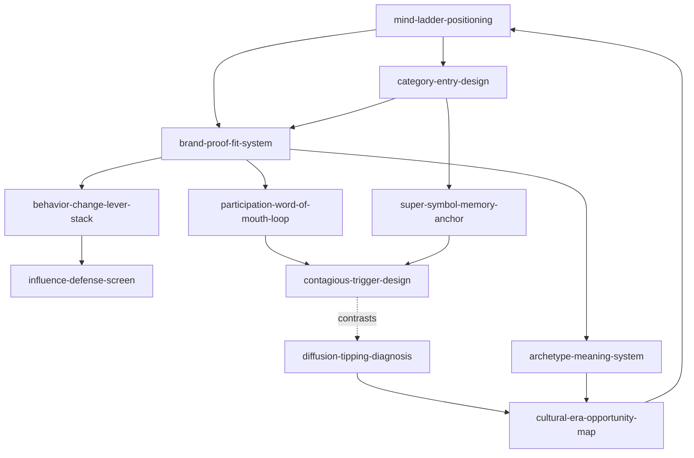
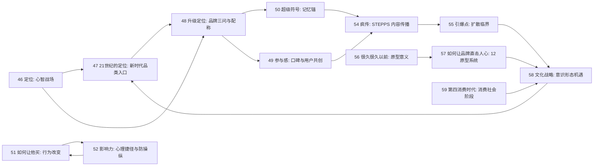

# 04 营销和定位 Skill Index

> 本分类由 book2skill / RIA-TV++ 蒸馏，产出 11 个 skills。处理时间：2026-06-18。

## 关于这个分类

- **范围**：定位、品类、品牌配称、口碑参与、超级符号、行为改变、影响力伦理、疯传、引爆点、品牌原型、文化战略和消费时代。
- **一句话主旨**：帮助 agent 判断品牌如何占据心智、建立可信差异、促成行动、形成传播，并匹配更深层的文化和消费趋势。
- **分类理解**：见 [BOOK_OVERVIEW.md](./BOOK_OVERVIEW.md)。

## 按问题选择 skill

| 用户问题 | 推荐 skill | 先读什么 | 不适合什么 |
|---|---|---|---|
| “品牌到底该代表什么？” | [`mind-ladder-positioning`](./mind-ladder-positioning/SKILL.md) | 顾客心智、竞争阶梯、可占位置 | 单纯写广告语 |
| “能不能开新品类？”“赛道怎么命名？” | [`category-entry-design`](./category-entry-design/SKILL.md) | 品类、品牌名、视觉锤、对立面 | 普通产品改名包装 |
| “定位可信吗？”“业务能撑住吗？” | [`brand-proof-fit-system`](./brand-proof-fit-system/SKILL.md) | 品牌三问、证据、配称 | 定位尚未选择 |
| “怎么做用户共创和自然口碑？” | [`participation-word-of-mouth-loop`](./participation-word-of-mouth-loop/SKILL.md) | 参与节点、反馈、身份、机制 | 刷好评、伪互动 |
| “怎样让品牌一眼被记住？” | [`super-symbol-memory-anchor`](./super-symbol-memory-anchor/SKILL.md) | 公共符号、记忆锚、触点复用 | 脱离定位的审美探索 |
| “用户不买/不试用，行为卡在哪？” | [`behavior-change-lever-stack`](./behavior-change-lever-stack/SKILL.md) | 动机、能力、触发、社会影响、反馈 | 产品价值不成立的强推 |
| “这个转化设计是不是操纵？” | [`influence-defense-screen`](./influence-defense-screen/SKILL.md) | 互惠、承诺、社会认同、权威、稀缺 | 伪造评价或背书 |
| “内容为什么没人转发？” | [`contagious-trigger-design`](./contagious-trigger-design/SKILL.md) | STEPPS 六要素 | 买量、刷屏 |
| “这个趋势有没有引爆点？” | [`diffusion-tipping-diagnosis`](./diffusion-tipping-diagnosis/SKILL.md) | 关键人、附着力、环境 | 单条标题优化 |
| “品牌人格和故事怎么统一？” | [`archetype-meaning-system`](./archetype-meaning-system/SKILL.md) | 12 原型、北极星、品牌故事 | 调性形容词列表 |
| “品牌是否符合消费和文化大势？” | [`cultural-era-opportunity-map`](./cultural-era-opportunity-map/SKILL.md) | 意识形态机遇、消费社会阶段 | 实时热点预测 |

## 推荐调用顺序

1. `mind-ladder-positioning`：先判断顾客心智中是否有可占据位置。
2. `category-entry-design`：若旧品类无位置，再判断是否需要新品类入口。
3. `brand-proof-fit-system`：检查定位是否有证据和经营配称。
4. `super-symbol-memory-anchor`：把定位和品类转为可识别、可记忆、可复用的符号。
5. `participation-word-of-mouth-loop`：设计用户参与、反馈和口碑循环。
6. `behavior-change-lever-stack`：当目标是购买、试用、推荐等具体行为时，定位行为断点。
7. `influence-defense-screen`：对所有行为杠杆做真实性、透明和自愿筛查。
8. `contagious-trigger-design`：设计内容或产品功能的自然分享点。
9. `diffusion-tipping-diagnosis`：判断是否具备跨圈层扩散的关键人、附着力和环境。
10. `archetype-meaning-system`：统一品牌人格、故事和深层欲望。
11. `cultural-era-opportunity-map`：最后把品牌放回文化正统、社会变化和消费时代中校准。

## Skill 关系图



图例：

- `-->` depends-on 或 composes-with
- `-. contrasts .->` contrasts-with

## 书之间的关系



## 小类归类

| 小类 | 书 | 主要 skill |
|---|---|---|
| 定位类 | 46《定位》、47《21世纪的定位》、48《升级定位》 | `mind-ladder-positioning`, `category-entry-design`, `brand-proof-fit-system` |
| 营销实战策略 | 49《参与感》、50《超级符号》 | `participation-word-of-mouth-loop`, `super-symbol-memory-anchor` |
| 营销心理学 | 51《如何让他买》、52《影响力》 | `behavior-change-lever-stack`, `influence-defense-screen` |
| 营销传播学 | 54《疯传》、55《引爆点》、56/57 原型书 | `contagious-trigger-design`, `diffusion-tipping-diagnosis`, `archetype-meaning-system` |
| 符合大势的品牌 | 58《文化战略》、59《第四消费时代》 | `cultural-era-opportunity-map` |

## 审计轨迹

- 候选单元池：[candidates/](./candidates/)
- 通过单元：[verified.md](./verified.md)
- 被淘汰候选：[rejected/rejected-units.md](./rejected/rejected-units.md)
- 来源与去重：[source/SOURCE.md](./source/SOURCE.md)

## 接入 darwin-skill

每个 skill 均带有 `test-prompts.json`，可用于后续 darwin-skill 进化。发布前先运行：

```bash
node scripts/validate-book2skill.js 04-marketing-positioning-skills
```
