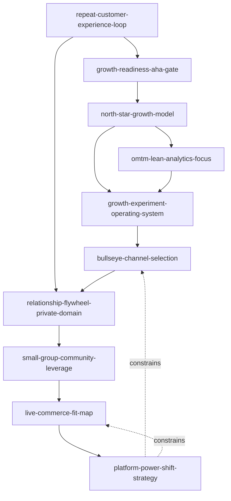

# 05 增长和流量 Skill Index

> 本分类由 book2skill / RIA-TV++ 蒸馏，产出 10 个 skills。处理时间：2026-06-18。

## 关于这个分类

- **范围**：回头客、增长黑客、精益数据、渠道拉新、私域关系、小群社群、直播电商、流媒体平台。
- **一句话主旨**：用复购、指标、实验、渠道、关系和平台生态来判断可持续增长。
- **分类理解**：见 [BOOK_OVERVIEW.md](./BOOK_OVERVIEW.md)。

## 按问题选择 skill

| 用户问题 | 推荐 skill | 先读什么 | 不适合什么 |
|---|---|---|---|
| “流量越来越贵，怎么降低获客压力？” | [`repeat-customer-experience-loop`](./repeat-customer-experience-loop/SKILL.md) | 客户体验、复购、口碑、文化 | 短期投放优化 |
| “产品还没起量，能不能开始大规模增长？” | [`growth-readiness-aha-gate`](./growth-readiness-aha-gate/SKILL.md) | 啊哈时刻、不可或缺性、留存 | 纯渠道选择 |
| “增长团队怎么跑实验？” | [`growth-experiment-operating-system`](./growth-experiment-operating-system/SKILL.md) | 跨职能团队、实验节奏、学习闭环 | 单次活动复盘 |
| “北极星指标怎么定，增长模型怎么拆？” | [`north-star-growth-model`](./north-star-growth-model/SKILL.md) | 用户价值、用户旅程、输入变量 | 虚荣指标包装 |
| “数据很多但不知道看哪个？” | [`omtm-lean-analytics-focus`](./omtm-lean-analytics-focus/SKILL.md) | OMTM、阶段、商业模式、同期群 | 常规报表美化 |
| “该选哪个获客渠道？” | [`bullseye-channel-selection`](./bullseye-channel-selection/SKILL.md) | 靶心、19 个渠道、中环测试、关键道路 | 已经明确渠道后的投放细节 |
| “私域、超级用户、复购怎么做？” | [`relationship-flywheel-private-domain`](./relationship-flywheel-private-domain/SKILL.md) | 亲密关系、超级用户、信任账户 | 群发促销 |
| “社群为什么沉默，怎么用小群增长？” | [`small-group-community-leverage`](./small-group-community-leverage/SKILL.md) | 小群效应、三近一反、连接者、互动 | 大群灌水运营 |
| “这个品类适合直播电商吗？” | [`live-commerce-fit-map`](./live-commerce-fit-map/SKILL.md) | 人货场、主播、平台、供应链、信任 | 只看主播流量 |
| “平台变了，内容或媒体业务怎么判断机会？” | [`platform-power-shift-strategy`](./platform-power-shift-strategy/SKILL.md) | 分发权力、数据、捆绑、盗版、平台依赖 | 短期内容选题 |

## 推荐调用顺序

1. `repeat-customer-experience-loop`：先判断增长能否沉淀为复购和口碑。
2. `growth-readiness-aha-gate`：确认产品是否具备增长门禁。
3. `north-star-growth-model`：把增长目标转成用户价值和增长模型。
4. `omtm-lean-analytics-focus`：按阶段选唯一关键指标，防止虚荣指标。
5. `growth-experiment-operating-system`：建立跨职能实验节奏。
6. `bullseye-channel-selection`：选择并验证核心获客渠道。
7. `relationship-flywheel-private-domain`：当增长需要复利时，经营超级用户和私域关系。
8. `small-group-community-leverage`：当传播依赖社群时，用小群和连接者提升活跃、转化和留存。
9. `live-commerce-fit-map`：当增长进入直播电商时，检查品类、主播、平台和供应链匹配。
10. `platform-power-shift-strategy`：当平台规则或内容分发改变时，重新评估权力位置。

## Skill 关系图



图例：

- `-->` depends-on 或 composes-with
- `-. constrains .->` 平台环境约束前序增长动作

## 书之间的关系


## 审计轨迹

- 候选单元池：[candidates/](./candidates/)
- 通过单元：[verified.md](./verified.md)
- 被淘汰候选：[rejected/rejected-units.md](./rejected/rejected-units.md)
- 来源与去重：[source/SOURCE.md](./source/SOURCE.md)

## 接入 darwin-skill

每个 skill 均带有 `test-prompts.json`，可用于后续 darwin-skill 进化。发布前先运行：

```bash
node scripts/validate-book2skill.js 05-growth-and-traffic-skills
```
