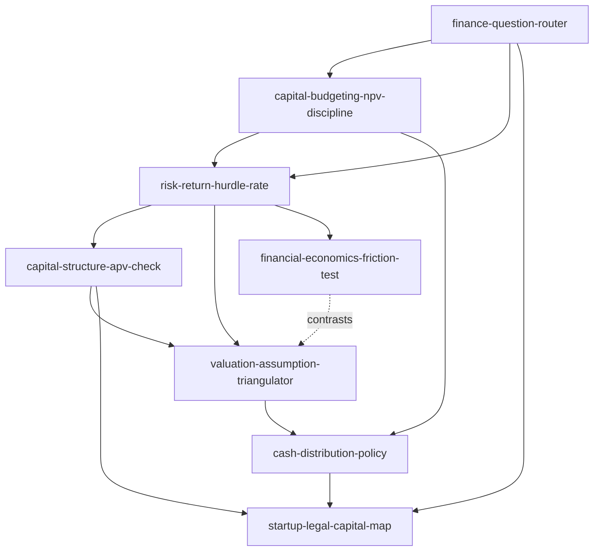
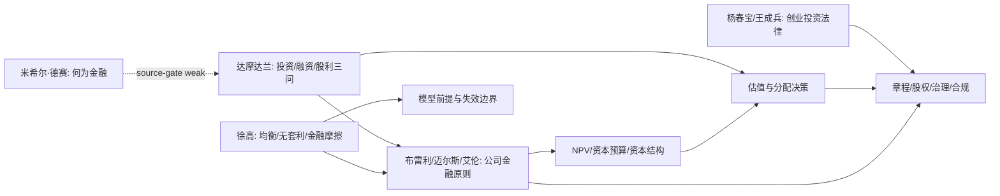

# 06 财务金融和法律 Skill Index

> 本分类由 book2skill / RIA-TV++ 蒸馏，产出 8 个 skills。处理时间：2026-06-18。

## 关于这个分类

- **范围**：公司金融、金融经济学、应用公司理财、创业投资法律。
- **一句话主旨**：用现金流、风险、资本结构、估值假设和法律契约共同判断企业资本决策。
- **分类理解**：见 [BOOK_OVERVIEW.md](./BOOK_OVERVIEW.md)。

## 按问题选择 skill

| 用户问题 | 推荐 skill | 先读什么 | 不适合什么 |
|---|---|---|---|
| “这是投资、融资、估值还是法律问题？” | [`finance-question-router`](./finance-question-router/SKILL.md) | 投资/融资/分配/法律入口 | 直接给结论 |
| “这个项目值不值得做？” | [`capital-budgeting-npv-discipline`](./capital-budgeting-npv-discipline/SKILL.md) | 增量现金流、NPV、机会成本 | 只看利润率 |
| “折现率/资本成本/风险溢价怎么算？” | [`risk-return-hurdle-rate`](./risk-return-hurdle-rate/SKILL.md) | 项目风险、beta、市场风险 | 把所有风险都加价 |
| “该用多少债？WACC 能不能用？” | [`capital-structure-apv-check`](./capital-structure-apv-check/SKILL.md) | 资本结构、税盾、APV | 机械调 WACC |
| “这个估值靠谱吗？” | [`valuation-assumption-triangulator`](./valuation-assumption-triangulator/SKILL.md) | DCF、倍数、增长、再投资 | 给目标价 |
| “要不要分红/回购/留存现金？” | [`cash-distribution-policy`](./cash-distribution-policy/SKILL.md) | 好项目、自由现金流、控制权 | 只看账上现金 |
| “模型前提是不是失效了？” | [`financial-economics-friction-test`](./financial-economics-friction-test/SKILL.md) | 均衡、无套利、摩擦 | 用模型装权威 |
| “融资、股权、章程、IP 有什么法律坑？” | [`startup-legal-capital-map`](./startup-legal-capital-map/SKILL.md) | 设立、股权、治理、知识产权 | 替代律师意见 |

## 推荐调用顺序

1. `finance-question-router`：先把问题分到投资、融资、分配、估值、金融模型或法律契约入口。
2. `capital-budgeting-npv-discipline`：若是项目选择，先建立增量现金流和 NPV。
3. `risk-return-hurdle-rate`：为项目或估值设定风险调整门槛。
4. `capital-structure-apv-check`：若融资结构会改变价值或风险，检查 WACC/APV 假设。
5. `valuation-assumption-triangulator`：若需要估值，把现金流、增长、风险、再投资和融资假设对齐。
6. `cash-distribution-policy`：若讨论分红、回购或留存，把好项目和自由现金流放在前面。
7. `financial-economics-friction-test`：当模型结果与现实冲突时，回查均衡、无套利和摩擦。
8. `startup-legal-capital-map`：所有创业融资、股权和治理方案落地前，用法律地图做边界检查。

## Skill 关系图



图例：

- `-->` depends-on 或 composes-with
- `-. contrasts .->` contrasts-with

## 书之间的关系



## 审计轨迹

- 候选单元池：[candidates/](./candidates/)
- 通过单元：[verified.md](./verified.md)
- 被淘汰候选：[rejected/rejected-units.md](./rejected/rejected-units.md)
- 来源与去重：[source/SOURCE.md](./source/SOURCE.md)

## 接入 darwin-skill

每个 skill 均带有 `test-prompts.json`，可用于后续 darwin-skill 进化。发布前先运行：

```bash
node scripts/validate-book2skill.js 06-finance-law-skills
```
