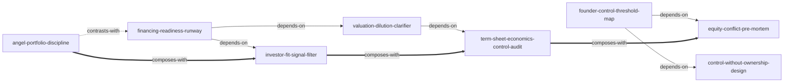

# 07_股权分配和融资 — Skill Index

> 本分类由 book2skill 蒸馏, 共产出 **8** 个 skills。
> 处理时间: 2026-06-18

## 关于这个分类

- **来源**: 行者创业系统 `07_股权分配和融资`
- **覆盖书目**: 7 本
- **一句话主旨**: 在创业公司分股、融资和治理中, 把钱、权、人、条款和退出放在同一张风险地图里判断。
- **分类理解**: 见 [BOOK_OVERVIEW.md](./BOOK_OVERVIEW.md)

## Skill 列表

### 内部分股与控制权

- [`founder-control-threshold-map`](./founder-control-threshold-map/SKILL.md) — 用持股比例、表决权、董事会和公司类型检查控制权边界。
- [`control-without-ownership-design`](./control-without-ownership-design/SKILL.md) — 在共享经济利益时选择有限合伙、委托投票、章程等分股不分权工具。

### 融资准备与投资人选择

- [`financing-readiness-runway`](./financing-readiness-runway/SKILL.md) — 判断现在是否该融资、融多少钱、材料和 runway 是否够。
- [`investor-fit-signal-filter`](./investor-fit-signal-filter/SKILL.md) — 按阶段、基金结构、退出压力、资源和冲突过滤投资人。

### 估值与条款

- [`valuation-dilution-clarifier`](./valuation-dilution-clarifier/SKILL.md) — 澄清投资前/后估值、完全稀释、期权池和真实 cap table。
- [`term-sheet-economics-control-audit`](./term-sheet-economics-control-audit/SKILL.md) — 把 Term Sheet 拆成经济因素和控制因素逐项审计。

### 投资侧与失败预演

- [`angel-portfolio-discipline`](./angel-portfolio-discipline/SKILL.md) — 用组合纪律、单笔上限和筛选漏斗约束天使投资冲动。
- [`equity-conflict-pre-mortem`](./equity-conflict-pre-mortem/SKILL.md) — 在签约前预演资本、合伙人、亲属、董事会、监管和退出冲突。

## 按问题入口选择

| 你的问题 | 优先调用 | 可组合调用 |
|---|---|---|
| 三个创始人怎么分股才不僵局 | `founder-control-threshold-map` | `equity-conflict-pre-mortem` |
| 要给员工股权但不想治理失控 | `control-without-ownership-design` | `founder-control-threshold-map` |
| 公司快没钱了, 现在该不该融资 | `financing-readiness-runway` | `investor-fit-signal-filter` |
| 有多个投资人, 不知道选谁 | `investor-fit-signal-filter` | `term-sheet-economics-control-audit` |
| 投资人说估值很高, 但我看不懂稀释 | `valuation-dilution-clarifier` | `term-sheet-economics-control-audit` |
| 收到 Term Sheet, 想知道哪些条款危险 | `term-sheet-economics-control-audit` | `equity-conflict-pre-mortem` |
| 我想做天使投资 | `angel-portfolio-discipline` | `investor-fit-signal-filter` |
| 已经有股东矛盾或担心未来控制权争夺 | `equity-conflict-pre-mortem` | `founder-control-threshold-map` |

## 引用图



图例:
- `-->` depends-on
- `-.->` contrasts-with
- `===>` composes-with

## 推荐调用顺序

1. **founder-control-threshold-map** — 先知道现在谁能决定什么、谁能阻断什么。
2. **control-without-ownership-design** — 需要激励或融资时, 再设计钱权分离工具。
3. **financing-readiness-runway** — 只有业务证据、资料和 runway 勉强够时才进入融资动作。
4. **investor-fit-signal-filter** — 先筛投资人类型, 再谈估值。
5. **valuation-dilution-clarifier** — 把估值语言转成融资前后 cap table。
6. **term-sheet-economics-control-audit** — 审查经济条款和控制条款。
7. **equity-conflict-pre-mortem** — 签重大协议前跑一次股权战争预演。
8. **angel-portfolio-discipline** — 只有用户站在投资人侧时调用; 创业者侧可用来理解投资人逻辑。

## 不建议的混用方式

- 不要在业务证据不足时直接调用估值和 Term Sheet skill 来包装融资故事。
- 不要用 `control-without-ownership-design` 规避必要的信息披露、税务、监管或小股东保护。
- 不要用 `angel-portfolio-discipline` 为非合格投资人提供投资建议。
- 不要把 `equity-conflict-pre-mortem` 的案例推演当成法律结论。

## 接入 darwin-skill

所有 skill 均带有 `test-prompts.json`:

```text
darwin evolve 07-equity-financing-skills/
```

## 审计轨迹

- 候选单元池: [candidates/](./candidates/)
- 被淘汰的候选: [rejected/](./rejected/)
- 分类理解: [BOOK_OVERVIEW.md](./BOOK_OVERVIEW.md)
- 来源去重: [source/SOURCE.md](./source/SOURCE.md)
