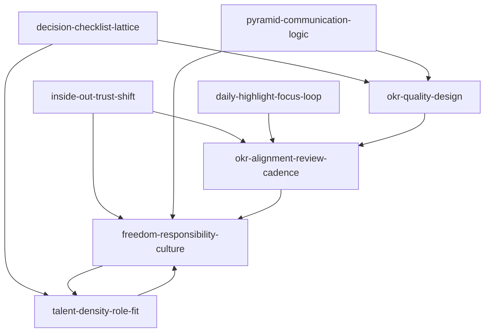
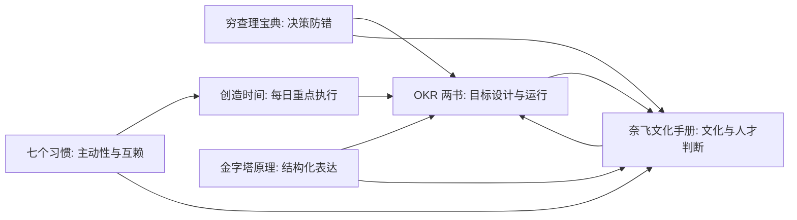

# 08 团队建设 Skill Index

> 本分类由 book2skill / RIA-TV++ 蒸馏，产出 8 个 skills。处理时间：2026-06-18。

## 关于这个分类

- **范围**：决策质量、个人效能、结构化沟通、OKR、文化、人才密度和角色适配。
- **一句话主旨**：用少数关键目标、清晰沟通、可信文化和高质量人才系统提升团队协作。
- **分类理解**：见 [BOOK_OVERVIEW.md](./BOOK_OVERVIEW.md)。
- **跨书 taxonomy**：见 [TEAM_BUILDING_SKILL_TAXONOMY.md](../TEAM_BUILDING_SKILL_TAXONOMY.md)。

## 按问题选择 skill

| 用户问题 | 推荐 skill | 先读什么 | 不适合什么 |
|---|---|---|---|
| “这个团队决策会不会有盲区？” | [`decision-checklist-lattice`](./decision-checklist-lattice/SKILL.md) | 逆向失败路径、能力圈、多元模型、检查清单 | 证券投资建议、纯价值观讨论 |
| “团队互相甩锅/不信任，怎么转行动？” | [`inside-out-trust-shift`](./inside-out-trust-shift/SKILL.md) | 主动性、影响圈、互赖协作、信任账户 | 心理治疗、人格评判 |
| “大家很忙但重要事没人推进？” | [`daily-highlight-focus-loop`](./daily-highlight-focus-loop/SKILL.md) | 每日 Highlight、注意力防护、能量、复盘 | 长期战略规划、组织架构设计 |
| “战略/复盘/OKR 材料讲不清楚？” | [`pyramid-communication-logic`](./pyramid-communication-logic/SKILL.md) | 结论先行、读者问题、逻辑分组、证据检查 | 美化措辞、缺证据的包装 |
| “我们的 OKR 像任务清单或 KPI，怎么改？” | [`okr-quality-design`](./okr-quality-design/SKILL.md) | Objective/KR 区分、数量控制、结果验证、非绩效化 | 日常待办管理 |
| “目标定了但跨团队不对齐，复盘也虚？” | [`okr-alignment-review-cadence`](./okr-alignment-review-cadence/SKILL.md) | 公开透明、纵横对齐、评分、季度复盘、CFR | 单次项目排期 |
| “流程太多、决策慢，想提高自治和坦诚？” | [`freedom-responsibility-culture`](./freedom-responsibility-culture/SKILL.md) | 自由与责任、上下文、成年人假设、坦诚辩论 | 低信任环境下直接去流程 |
| “岗位不匹配、团队能力跟不上未来任务？” | [`talent-density-role-fit`](./talent-density-role-fit/SKILL.md) | 未来团队图、角色适配、人才密度、反馈与退出 | 简单裁员建议 |

## 推荐调用顺序

1. `decision-checklist-lattice`：在大方向、目标和人才判断前先做反向风险审计。
2. `inside-out-trust-shift`：若问题涉及责任、冲突和互信，先把可影响行动拆出来。
3. `daily-highlight-focus-loop`：若执行层被会议和通知吞没，把目标落到每日重点。
4. `pyramid-communication-logic`：需要争取共识、写 memo、做复盘时，用结构化表达承载判断。
5. `okr-quality-design`：把模糊愿望改成少数 Objectives 和可验证 Key Results。
6. `okr-alignment-review-cadence`：让 OKR 进入公开对齐、追踪、评分、复盘和 CFR 节奏。
7. `freedom-responsibility-culture`：当流程成为瓶颈时，检查是否能用上下文和责任替代控制。
8. `talent-density-role-fit`：最后回到团队能力结构，判断现有人才是否匹配未来任务。

## Skill 关系图



图例：

- `-->` depends-on 或 composes-with
- 互相回指代表组织系统中的循环关系

## 书之间的关系



## 审计轨迹

- 候选单元池：[candidates/](./candidates/)
- 通过单元：[verified.md](./verified.md)
- 被淘汰候选：[rejected/rejected-units.md](./rejected/rejected-units.md)
- 来源与去重：[source/SOURCE.md](./source/SOURCE.md)
- 质量复核：[QUALITY_REVIEW.md](./QUALITY_REVIEW.md)

## 接入 darwin-skill

每个 skill 均带有 `test-prompts.json`，可用于后续 darwin-skill 进化。发布前先运行：

```bash
node scripts/validate-book2skill.js 08-team-building-skills
```
