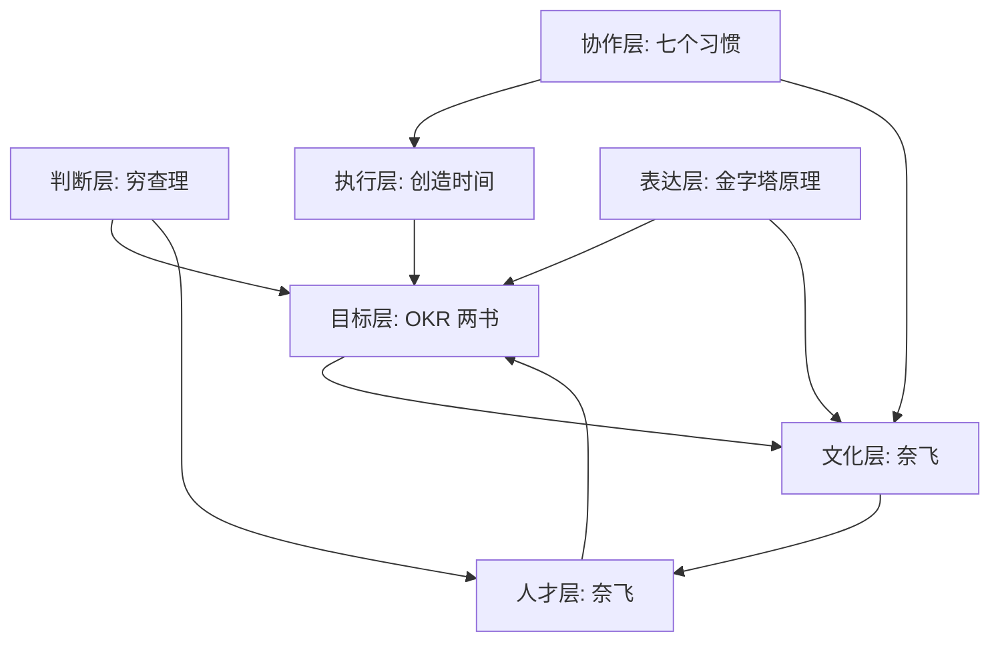

# 08 团队建设 Skill Taxonomy

本文档整理 `08-team-building-skills` 中 7 本书与 8 个 skills 的关系，帮助 agent 按问题归类调用。

## 总体地图

团队建设问题通常落在五个层级：

1. **判断层**：问题是否选对，风险是否看见。
2. **个人与协作层**：成员如何承担责任、保护注意力、建立互信。
3. **表达层**：重要判断能否被清晰讲明白。
4. **目标运行层**：组织是否有少数关键目标和复盘节奏。
5. **文化与人才层**：是否有能承接自由、责任和未来任务的人。

## 书籍关系

| 书 | 在体系中的位置 | 主要贡献 | 连接到 |
|---|---|---|---|
| 《穷查理宝典》 | 判断层 | 逆向思维、能力圈、多元模型、检查清单 | OKR 设计、人才判断、文化方案审计 |
| 《高效能人士的七个习惯》 | 个人与协作层 | 主动性、影响圈、要事优先、互赖协作 | 冲突处理、文化建设、目标执行 |
| 《创造时间》 | 个人执行层 | 每日重点、注意力防护、能量和复盘 | OKR 落地、团队节奏 |
| 《金字塔原理》 | 表达层 | 结论先行、读者问题、逻辑分组 | OKR 说明、复盘 memo、文化沟通 |
| 《OKR：源于英特尔和谷歌的目标管理利器》 | 目标设计与实施层 | O/KR 区分、CRAFT、评分、周期运行 | OKR 质量设计、对齐复盘 |
| 《这就是OKR》 | 目标动员与管理层 | 聚焦、对齐、追踪、挑战、CFR | OKR 运行、文化连接 |
| 《奈飞文化手册》 | 文化与人才层 | 自由责任、坦诚、成年人假设、人才密度 | 自治文化、角色适配 |

## 调用归类

| 问题类型 | 首选 skill | 组合 skill | 归类理由 |
|---|---|---|---|
| 决策风险、战略取舍、组织调整 | `decision-checklist-lattice` | `pyramid-communication-logic`、`talent-density-role-fit` | 先防错，再把判断写清楚，并检查人才影响 |
| 责任不清、互相甩锅、跨团队冲突 | `inside-out-trust-shift` | `freedom-responsibility-culture`、`okr-alignment-review-cadence` | 先确定影响圈，再处理文化和目标对齐 |
| 忙碌但无产出、会议吞噬时间 | `daily-highlight-focus-loop` | `okr-quality-design`、`okr-alignment-review-cadence` | 把目标压到每日重点，再检查目标是否过多 |
| 汇报、复盘、变革沟通不清 | `pyramid-communication-logic` | `decision-checklist-lattice`、`okr-quality-design` | 先按听众问题组织，再做反向审计 |
| OKR 像 KPI 或任务清单 | `okr-quality-design` | `pyramid-communication-logic`、`daily-highlight-focus-loop` | 先重写目标质量，再讲清楚和落到重点 |
| OKR 没有推进、跨团队依赖漂移 | `okr-alignment-review-cadence` | `inside-out-trust-shift`、`pyramid-communication-logic` | 运行问题通常来自节奏、责任和沟通缺口 |
| 流程重、审批慢、自治不足 | `freedom-responsibility-culture` | `talent-density-role-fit`、`inside-out-trust-shift` | 自由需要上下文、责任和人才条件 |
| 岗位不匹配、团队能力跟不上 | `talent-density-role-fit` | `decision-checklist-lattice`、`freedom-responsibility-culture` | 先定义未来角色，再审计判断偏差和文化承接 |

## 关系图

## 边界提示

- 遇到个人情绪、心理健康或法律劳动争议问题，不调用这些 skills 直接给诊断或法律意见。
- 遇到缺少事实的管理判断，先要求补充目标、团队结构、约束、时间范围和现有证据。
- 遇到“照搬某公司制度”的请求，优先调用边界段，要求先验证组织上下文。
