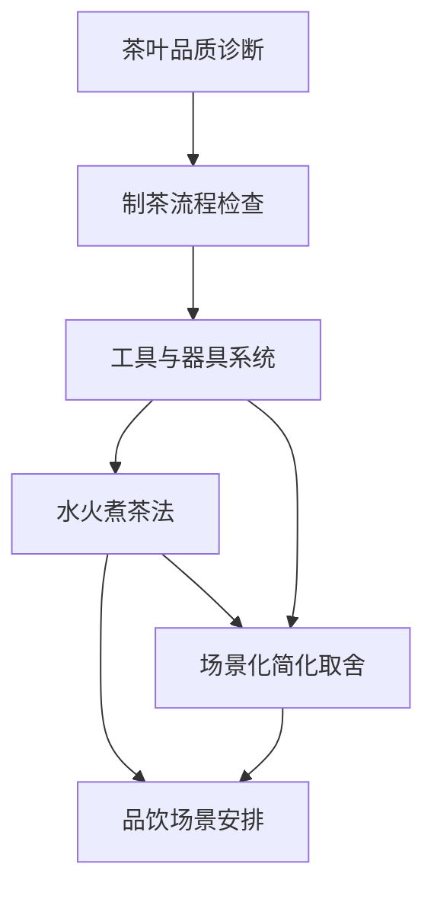

# 《茶经》Skill 索引

> v0.1 试点版：用于茶学学习、茶事流程设计、器具/水火/场景判断。源文件保留于 [source/chajing.md](./source/chajing.md)。

## 推荐调用顺序

1. `tea-quality-diagnosis`: 先判断茶样、产地、采摘和制作风险。
2. `tea-processing-workflow`: 需要讨论制茶过程时调用。
3. `tool-vessel-system`: 需要配置或检查茶具/器具时调用。
4. `water-fire-brewing-method`: 需要设计煮茶流程时调用。
5. `serving-tasting-context`: 需要安排品饮人数、盏数和场景时调用。
6. `contextual-simplification`: 需要在野外、课堂、展示、城市空间中决定取舍时调用。

## Skill 列表

| Skill | 什么时候用 | 不适合什么 |
|---|---|---|
| [tea-quality-diagnosis](tea-quality-diagnosis/SKILL.md) | 判断茶叶品质线索与风险 | 现代质检、价格评级 |
| [tea-processing-workflow](tea-processing-workflow/SKILL.md) | 检查采制流程是否完整 | 现代工业制茶参数 |
| [tool-vessel-system](tool-vessel-system/SKILL.md) | 配置或解释茶具器物系统 | 单纯古器物考据 |
| [water-fire-brewing-method](water-fire-brewing-method/SKILL.md) | 设计水、火、沸候、投茶步骤 | 现代冲泡法唯一标准 |
| [serving-tasting-context](serving-tasting-context/SKILL.md) | 安排饮茶人数、盏数、次第 | 宴会礼仪通论 |
| [contextual-simplification](contextual-simplification/SKILL.md) | 判断哪些器具/步骤可省 | 偷工减料或降低关键质量 |

## 引用图

## 来源说明

- 本 skill pack 的本地源文件: [source/chajing.md](./source/chajing.md)
- 来源说明: [source/SOURCE.md](./source/SOURCE.md)
- 线上来源: https://zh.wikisource.org/zh-hans/茶經

