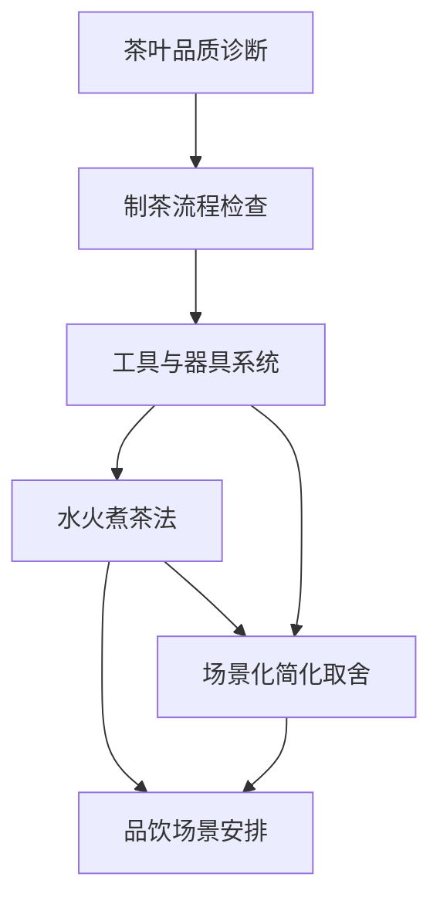

# 《茶经》Skills for AI Agents

> 用陆羽《茶经》的系统方法训练 AI：识别茶叶品质、检查制茶流程、配置器具、设计水火煮茶法，并按场景做取舍。

[](https://github.com/kangarooking/cangjie-skill)

---

## 源文件

本 skill pack 保留《茶经》源文件：

- 本地源文件: [source/chajing.md](./source/chajing.md)
- 来源说明: [source/SOURCE.md](./source/SOURCE.md)
- 线上来源: https://zh.wikisource.org/zh-hans/茶經

## 这套 Skills 能解决什么问题？

| 使用场景 | 调用 Skill |
|---|---|
| 想判断一段茶样描述里的品质线索与风险 | [`tea-quality-diagnosis`](./tea-quality-diagnosis/SKILL.md) |
| 想按《茶经》检查采茶、制茶流程 | [`tea-processing-workflow`](./tea-processing-workflow/SKILL.md) |
| 想配置茶具或解释某件茶器的功能 | [`tool-vessel-system`](./tool-vessel-system/SKILL.md) |
| 想按水、火、沸候、投茶设计煮茶流程 | [`water-fire-brewing-method`](./water-fire-brewing-method/SKILL.md) |
| 想安排几人品饮、几盏、如何分饮 | [`serving-tasting-context`](./serving-tasting-context/SKILL.md) |
| 想知道在野外/课堂/展示中哪些步骤可省 | [`contextual-simplification`](./contextual-simplification/SKILL.md) |

---

## 技能体系总览



## 使用示例

```text
请读取 chajing-skill/INDEX.md，了解《茶经》skills 的调用顺序。
我想做一次小型茶事教学，请按《茶经》帮我判断：哪些器具必须保留，哪些可以在课堂场景中省略？
```

```text
请读取 chajing-skill/water-fire-brewing-method/SKILL.md。
我想演示唐代煮茶，请按水、火、沸候、投茶、分饮给出流程和失败点。
```

## 仓库结构

```text
chajing-skill/
├── README.md
├── BOOK_OVERVIEW.md
├── INDEX.md
├── source/
│   ├── chajing.md
│   └── SOURCE.md
├── candidates/
├── rejected/
├── tea-quality-diagnosis/
├── tea-processing-workflow/
├── tool-vessel-system/
├── water-fire-brewing-method/
├── serving-tasting-context/
└── contextual-simplification/
```

## 边界

- 本 skill pack 用于茶学学习、茶事流程设计和古籍方法论转化。
- 不提供现代医学建议、食品安全结论、商品茶价格评级或商业质检报告。
- 古籍中关于产地、器具和功效的判断应结合时代背景使用。

