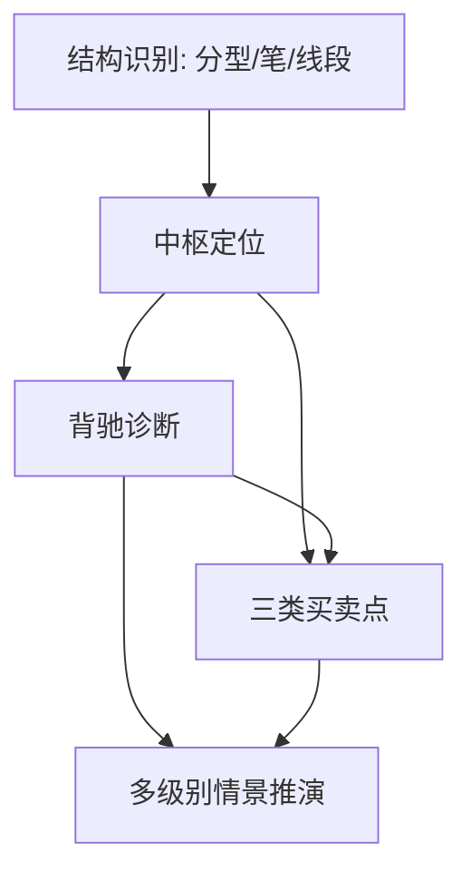

# 《缠论》Skill 索引

> v0.1 试点版：用于训练 AI 按缠论框架做走势结构分析、复盘和交易计划检查。不是投资建议，不负责预测收益。

## 推荐调用顺序

1. `chanlun-structure-parser`: 先处理 K 线、分型、笔、线段。
2. `chanlun-zhongshu-mapper`: 再定位中枢，判断盘整/趋势/延续/扩张。
3. `chanlun-divergence-diagnosis`: 当用户问“是不是背驰/背离/转折”时调用。
4. `chanlun-buy-sell-points`: 当用户问“一买二买三买/卖点”时调用。
5. `chanlun-multi-level-scenario`: 当多级别信号冲突或要做预案时调用。

## Skill 列表

| Skill | 什么时候用 | 不适合什么 |
|---|---|---|
| [chanlun-structure-parser](chanlun-structure-parser/SKILL.md) | 用户要把行情图拆成分型、笔、线段 | 没有 K 线数据或只问宏观新闻 |
| [chanlun-zhongshu-mapper](chanlun-zhongshu-mapper/SKILL.md) | 用户要判断中枢、盘整、趋势、扩张 | 只想知道支撑压力位 |
| [chanlun-divergence-diagnosis](chanlun-divergence-diagnosis/SKILL.md) | 用户怀疑背驰、MACD 背离、趋势衰竭 | 没有同级别 A-B-C 段 |
| [chanlun-buy-sell-points](chanlun-buy-sell-points/SKILL.md) | 用户想识别一买、二买、三买或卖点 | 用户要求直接荐股/喊单 |
| [chanlun-multi-level-scenario](chanlun-multi-level-scenario/SKILL.md) | 用户要处理小级别和大级别冲突 | 用户只问单个指标含义 |

## 引用图

## 来源线索

- `走势终完美` 与中枢定义: https://chzhshch.org/2006/12/18/0412-%E6%95%99%E4%BD%A0%E7%82%92%E8%82%A1%E7%A5%A817/
- `中枢级别扩张` 与第三类买卖点: https://chzhshch.org/2007/01/05/0424-%E6%95%99%E4%BD%A0%E7%82%92%E8%82%A1%E7%A5%A820/
- `买卖点完备性`: https://chzhshch.org/2007/01/09/0428-%E6%95%99%E4%BD%A0%E7%82%92%E8%82%A1%E7%A5%A821/
- `MACD 对背驰的辅助判断`: https://chzhshch.org/2007/01/18/0436-%E6%95%99%E4%BD%A0%E7%82%92%E8%82%A1%E7%A5%A824/
- `转折力度与级别`: https://chzhshch.org/2007/02/09/0456-%E6%95%99%E4%BD%A0%E7%82%92%E8%82%A1%E7%A5%A829/
- `分型、笔、线段`: https://chzhshch.org/2007/07/16/0593-%E6%95%99%E4%BD%A0%E7%82%92%E8%82%A1%E7%A5%A865/

