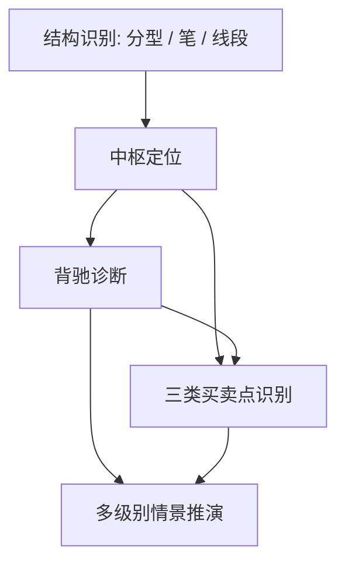

# 《缠论》Skills for AI Agents

> 用《缠论》的结构化分析框架训练 AI：先识别走势结构，再判断中枢、背驰、买卖点和多级别情景。

[](https://github.com/kangarooking/cangjie-skill)

---

## 这套 Skills 能解决什么问题？

| 使用场景 | 调用 Skill |
|---|---|
| 想把 K 线走势先拆成分型、笔、线段 | [`chanlun-structure-parser`](./chanlun-structure-parser/SKILL.md) |
| 想判断中枢区间、趋势/盘整/扩张 | [`chanlun-zhongshu-mapper`](./chanlun-zhongshu-mapper/SKILL.md) |
| 怀疑出现顶背驰/底背驰 | [`chanlun-divergence-diagnosis`](./chanlun-divergence-diagnosis/SKILL.md) |
| 想判断一买、二买、三买或卖点类型 | [`chanlun-buy-sell-points`](./chanlun-buy-sell-points/SKILL.md) |
| 多级别信号冲突，需要做情景预案 | [`chanlun-multi-level-scenario`](./chanlun-multi-level-scenario/SKILL.md) |

---

## 技能体系总览



推荐顺序：

1. `chanlun-structure-parser`：统一基础结构。
2. `chanlun-zhongshu-mapper`：定位中枢和走势类型。
3. `chanlun-divergence-diagnosis`：检查背驰是否成立。
4. `chanlun-buy-sell-points`：判断候选买卖点类型。
5. `chanlun-multi-level-scenario`：输出多级别情景树。

---

## 效果示例

**场景：** 用户怀疑某处是第三类买点。

**普通 AI 可能会说：**

> 看起来突破后回踩，可以考虑关注。

**调用本 skill 后应输出：**

```text
分析级别：5 分钟；次级别观察为 1 分钟。

已确认结构：
- 前中枢区间为 [10.20, 10.80]。
- 价格向上离开中枢。
- 第一次回调最低 10.92，暂未回到中枢上沿 10.80 以下。

可能买卖点类型：
- 候选第三类买点。

成立条件：
- 必须是离开中枢后的第一次次级别回调。
- 回调低点不跌回中枢。
- 次级别止跌结构不能被破坏。

失效条件：
- 跌回 10.80 以下。
- 后续无法向上离开，转为更大级别中枢扩张。

风险提示：
- 这是结构分析，不是买入建议。
```

---

## 仓库结构

```text
chanlun-skills/
├── README.md
├── INDEX.md
├── BOOK_OVERVIEW.md
├── 使用介绍页.md
├── candidates/
│   └── frameworks.md
├── rejected/
│   └── rejected-units.md
├── chanlun-structure-parser/
│   ├── SKILL.md
│   └── test-prompts.json
├── chanlun-zhongshu-mapper/
│   ├── SKILL.md
│   └── test-prompts.json
├── chanlun-divergence-diagnosis/
│   ├── SKILL.md
│   └── test-prompts.json
├── chanlun-buy-sell-points/
│   ├── SKILL.md
│   └── test-prompts.json
└── chanlun-multi-level-scenario/
    ├── SKILL.md
    └── test-prompts.json
```

---

## 如何使用

### 方式一：先读索引

```text
请读取 chanlun-skills/INDEX.md，了解《缠论》skill 的调用顺序。
然后根据我的走势描述，选择合适的 skill 做结构分析。
```

### 方式二：指定一个 skill

```text
请读取 chanlun-skills/chanlun-divergence-diagnosis/SKILL.md。
我怀疑这里有顶背驰，请按 A-B-C 段、级别一致性、MACD 辅助条件检查，不要直接预测涨跌。
```

### 方式三：使用标准输出格式

```text
请使用《缠论》skill，输出：
1. 分析级别
2. 已确认结构
3. 未确认结构
4. 中枢区间
5. 可能买卖点类型
6. 成立条件
7. 失效条件
8. 需要补充的数据
9. 风险提示
```

更多提示词见：[使用介绍页.md](./%E4%BD%BF%E7%94%A8%E4%BB%8B%E7%BB%8D%E9%A1%B5.md)。

---

## 来源与边界

- 来源：缠中说禅博客公开存档中的《教你炒股票》关键章节。
- 方法：参考 [cangjie-skill](https://github.com/kangarooking/cangjie-skill) 的 RIA-TV++ / book2skill 流水线。
- 边界：本 skill 只做结构化分析训练，不做荐股、喊单、收益承诺或具体买卖指令。
