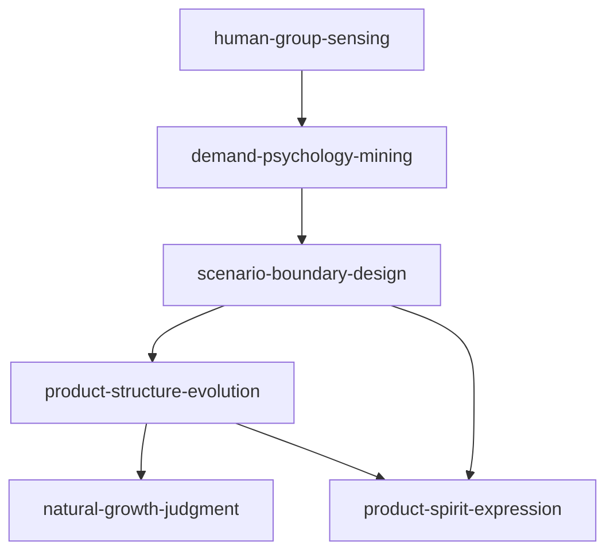

# 《微信背后的产品观》Skill 索引

> v0.1 试点版：用于训练 AI 按微信产品观做用户洞察、需求判断、场景取舍、结构设计、增长判断和气质审查。

## 推荐调用顺序

1. `human-group-sensing`: 先把目标用户还原为具体的人和群体行为。
2. `demand-psychology-mining`: 再从功能请求下钻到心理诉求。
3. `scenario-boundary-design`: 判断功能在什么场景成立、应如何取舍。
4. `product-structure-evolution`: 检查功能是否破坏产品结构和 DNA。
5. `natural-growth-judgment`: 当讨论推广、导流、KPI、整合时调用。
6. `product-spirit-expression`: 当讨论文案、UI、欢迎页、品牌感和产品气质时调用。

## Skill 列表

| Skill | 什么时候用 | 不适合什么 |
|---|---|---|
| [human-group-sensing](human-group-sensing/SKILL.md) | 判断产品是否真的理解用户、草根用户和群体效应 | 只做人群标签画像 |
| [demand-psychology-mining](demand-psychology-mining/SKILL.md) | 把用户口头需求挖到心理驱动力 | 已确定的工程缺陷修复 |
| [scenario-boundary-design](scenario-boundary-design/SKILL.md) | 做功能取舍、默认项、隐藏入口和不打扰设计 | 单纯视觉美化 |
| [product-structure-evolution](product-structure-evolution/SKILL.md) | 检查产品结构、分类、抽象和演化方向 | 单个按钮样式调整 |
| [natural-growth-judgment](natural-growth-judgment/SKILL.md) | 判断是否该推广、导流、整合、多平台或 KPI 拉动 | 已经验证的投放执行优化 |
| [product-spirit-expression](product-spirit-expression/SKILL.md) | 审查产品文案、UI、欢迎页和整体气质 | 纯品牌营销口号生成 |

## 引用图

## 来源与边界

- 来源: 《微信背后的产品观》，张小龙编著；陈妍、张军主编，电子工业出版社，2021 年 1 月。
- 方法: 参考 [cangjie-skill](https://github.com/kangarooking/cangjie-skill) 的 RIA-TV++ / book2skill 流水线。
- 边界: 这是产品方法论蒸馏，不是微信功能复刻指南，不替代现代产品研究、数据实验或合规审查。
