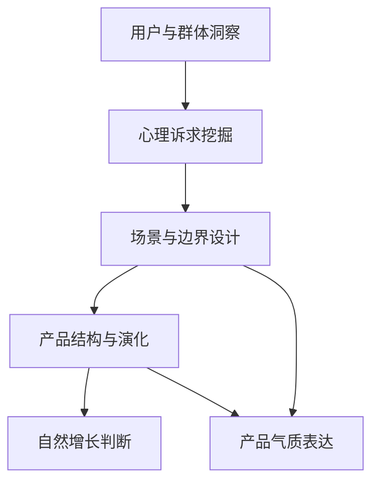

# 《微信背后的产品观》Skills for AI Agents

> 用张小龙的产品观训练 AI：从人性和群体行为识别真实需求，用场景、结构、边界和气质约束功能欲望。

[](https://github.com/kangarooking/cangjie-skill)

---

## 来源说明

- 原书: 《微信背后的产品观》，张小龙编著；陈妍、张军主编，电子工业出版社，2021 年 1 月。
- 本仓库不收录原书全文，仅保留方法论蒸馏与来源说明。
- 详见: [source/SOURCE.md](source/SOURCE.md)

## 这套 Skills 能解决什么问题？

| 使用场景 | 调用 Skill |
|---|---|
| 想判断一个产品判断是否真的从用户和群体出发 | [`human-group-sensing`](human-group-sensing/SKILL.md) |
| 想把用户口头需求挖到心理诉求层 | [`demand-psychology-mining`](demand-psychology-mining/SKILL.md) |
| 想决定一个功能该做、隐藏、延后还是砍掉 | [`scenario-boundary-design`](scenario-boundary-design/SKILL.md) |
| 想检查产品是否正在被功能堆砌拖垮 | [`product-structure-evolution`](product-structure-evolution/SKILL.md) |
| 想判断该不该推广、导流、整合或 KPI 拉动 | [`natural-growth-judgment`](natural-growth-judgment/SKILL.md) |
| 想检查产品文案、UI、欢迎页和体验是否有统一气质 | [`product-spirit-expression`](product-spirit-expression/SKILL.md) |

---

## 技能体系总览



## 使用示例

```text
请读取 wechat-product-philosophy-skill/INDEX.md。
我的产品团队想加一个“已读”功能，请按这套 skills 判断：它满足了什么心理诉求，又会破坏什么场景？
```

```text
请读取 wechat-product-philosophy-skill/demand-psychology-mining/SKILL.md。
用户说想要更强的分组功能，请帮我挖出背后的真实诉求，并给出不做全功能的替代方案。
```

## 仓库结构

```text
wechat-product-philosophy-skill/
├── README.md
├── BOOK_OVERVIEW.md
├── INDEX.md
├── source/
│   └── SOURCE.md
├── candidates/
│   └── frameworks.md
├── rejected/
│   └── rejected-units.md
├── human-group-sensing/
├── demand-psychology-mining/
├── scenario-boundary-design/
├── product-structure-evolution/
├── natural-growth-judgment/
└── product-spirit-expression/
```

## 边界

- 本 skill pack 用于产品判断、需求澄清、体验审查和方法论训练。
- 不替代用户研究、数据分析、合规评审、无障碍评测或商业策略。
- 不把微信案例机械套用到所有产品，尤其要谨慎用于 B2B、专业工具、监管产品和低频高风险场景。
